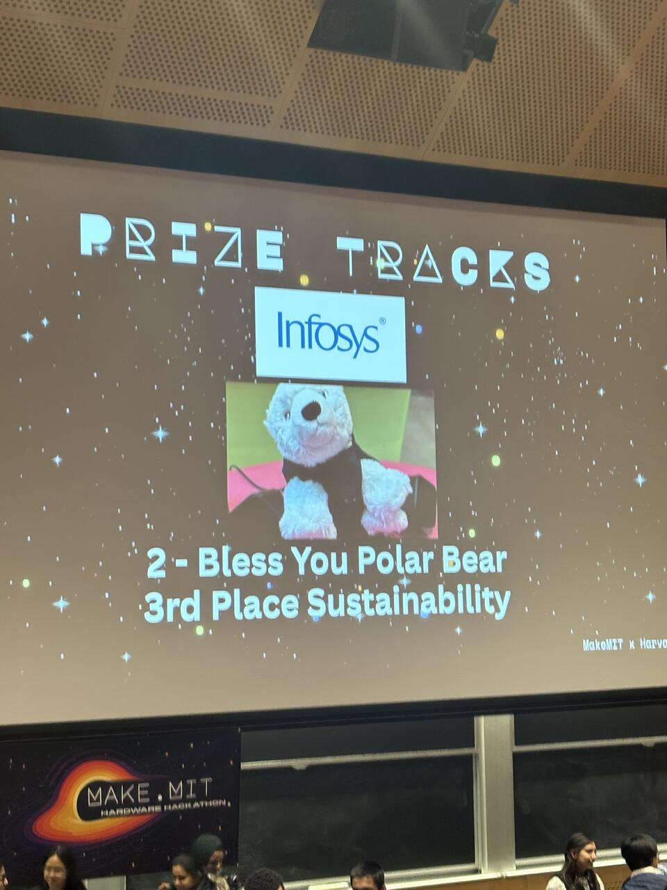

# Bless You Polar Bear - Award at MakeMIT Hackathon 2026, InfoSys Sustainability 3rd 

[Click to check Devpost](https://devpost.com/software/bless-you-polar-bear)

An interactive IoT companion device designed to bridge cultural gaps and provide comfort for international students and those living alone. Built with a Raspberry Pi, square LCD, and speaker housed inside a polar bear, the device detects sneezes in real-time using a custom-trained ML model and responds with a warm "Bless you!" animation and voice message. Key features include real-time sneeze detection robust to background noise (coughs, clapping, ambient sound), context-aware health advice powered by the Gemini API and ElevenLabs TTS, and live weather integration via Wttr.in for personalized tips like pollen warnings.
